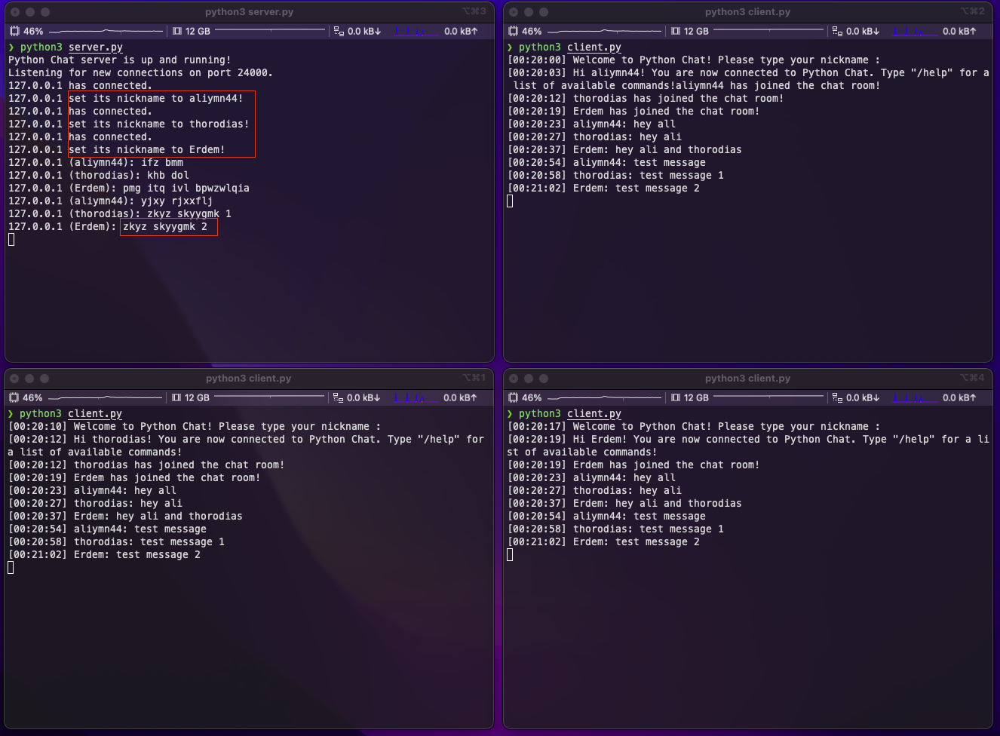
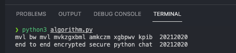
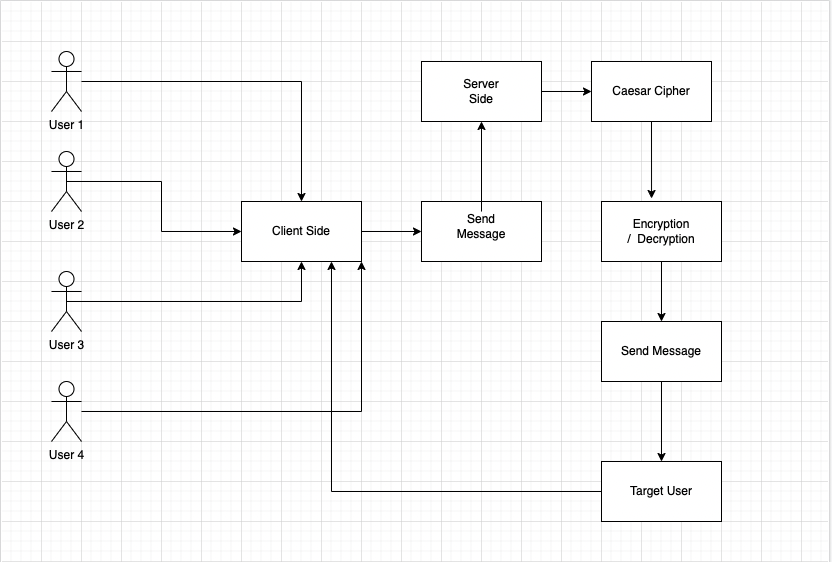

# End-to-End Python Chat

> Demo

This project has been prepared for the Cryptography course. 

> 1-) Technologies we use

- Python 3.9.8 version
- Python Socket library
- Caesar algorithm to Encryption and decryption
- some python library : atexit,threading,random,datetime and sys.

> 2-) Client.py (Client Side)

User sessions are created here and send messages from there.

- These are client side functions and  we will explain each item in detail.
- currentTime() function
- deleteLastLine() function
- send() function
- receive() function
- main() function

> 3-) Server.py (Server Side)

A server socket binds to a particular port on the local machine. Once it has successfully bound to a port, it listens for incoming connection attempts. When it detects a connection attempt, it accepts the connection. ... No more than one server socket can listen to a particular port at one time.

- connectionThread() function
- clientThread() function
- getNickname() function
- broadcast() function
- cleanup() function
- main() function

> 4-) Some Commands

There are some commands users can use;

- /quit : it to left the chat.
- /online : it to see online users.
- /help : it to see all commands and information about chat.

> Encryption and Decryption Algorithm (algorithm.py)

In cryptography, a Caesar cipher, also known as Caesar's cipher, the shift cipher, Caesar's code or Caesar shift, is one of the simplest and most widely known encryption techniques. It is a type of substitution cipher in which each letter in the plaintext is replaced by a letter some fixed number of positions down the alphabet. For example, with a left shift of 3, D would be replaced by A, E would become B, and so on. The method is named after Julius Caesar, who used it in his private correspondence.

